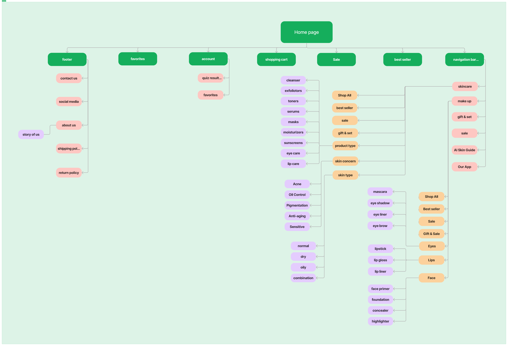

A closed card sort shows you how users expect content to be grouped on a website. Participants sort a set of cards (such as product names) into categories that you have already defined. The results tell you whether your navigation labels and structure match how people think.

This article uses the Natural Beauty project, a website and app for a vegan cosmetics brand, as an example.

## Closed or open?

- In a closed card sort, you provide the categories. Use it to test a structure you already have.
- In an open card sort, participants create their own categories. Use it early, when you have no structure yet.

## Before you start

You need:

- A draft list of categories (your main navigation)
- 20 to 40 cards, each showing one piece of content, such as a product type
- Participants who match your target users
- Physical cards or an online tool such as [Optimal Workshop](https://www.optimalworkshop.com/)

## Steps

1. Write the cards. Use plain words that users would recognize, and avoid copying your category names onto the cards, since that makes the answers obvious.
2. Set up the categories. Place them where every participant can see them.
3. Run the sessions. Ask each participant to place every card in the category where they would expect to find it. Ask them to think aloud so you hear their reasoning.
4. Record the results. Note where each card was placed and any cards that participants hesitated over.
5. Look for patterns. Cards placed in the same category by most participants confirm your structure. Cards that were spread across several categories point to confusing labels.
6. Update your site map. Rename or move categories based on what you learned.

## Example

The Natural Beauty team ran five closed card sorting sessions. The results shaped the site map and confirmed how users expected to move between product categories before any wireframes were drawn.

## Tips

- Five sessions can reveal clear patterns on a small site. Larger sites usually need more participants.
- Card sorting tests structure, not visual design. Test the finished navigation later with usability testing.

## Learn more

- [Card Sorting: Uncover Users' Mental Models](https://www.nngroup.com/articles/card-sorting-definition/) (Nielsen Norman Group)