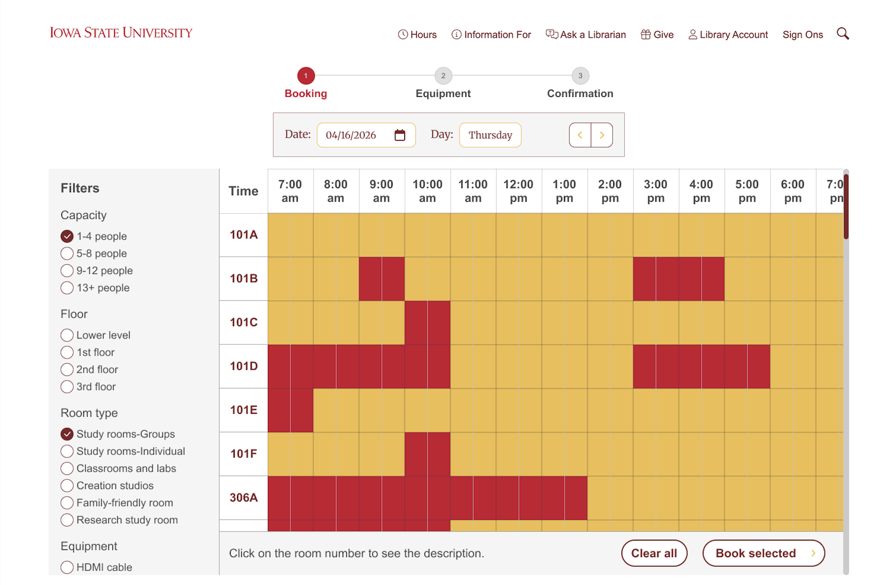

---
---
title: "How to Run a Usability Test and Score It with SUS"
description: "Compare two designs using tasks, error counts, and a standard satisfaction score."
---

A usability test shows how well real people can complete tasks with a design. Adding the System Usability Scale (SUS), a short standard questionnaire, gives you a single score you can compare against other designs.

This article uses the Parks Library study room booking redesign at Iowa State University as an example.

## Before you start

You need:

- The designs you want to test, such as the current system and a prototype
- Three to five realistic tasks
- Participants who match your target users
- A way to record time, errors, and task completion
- The [SUS questionnaire](https://measuringu.com/sus/) (10 questions, each answered on a 1 to 5 scale)

## Steps

1. Write the tasks. Each task should have a clear goal and end point, such as "Book a room for four people tomorrow at 2 p.m."
2. Choose a study design. In a within-subjects study, each participant uses both designs. Switch which design goes first for half the participants, so learning does not affect the results.
3. Run the sessions. Give one task at a time. Do not help participants unless they are completely stuck.
4. Measure performance. Record completion time, number of errors, and whether each task was completed.
5. Give the SUS questionnaire. Participants fill it out after using each design.
6. Calculate the SUS score for each participant, then average the scores.

## Calculating SUS

```text
Odd questions (1, 3, 5, 7, 9):   response - 1
Even questions (2, 4, 6, 8, 10): 5 - response
SUS score = (sum of all 10 values) x 2.5
```

Scores range from 0 to 100. The average score across many studies is 68, so a score above 68 is above average.



## Example results

Nine Iowa State students completed three booking tasks on both the current LibCal system and the redesign:

| Measure | Current system | Redesign |
|---|---|---|
| Errors per task (average) | 4.08 | 1.1 |
| Task failures | Over 50% on Task 3 | None |
| Completion time | Baseline | About 35% faster |

The redesign received a mean SUS score of 84.2, well above the average score of 68.

## Learn more

- [Usability Testing 101](https://www.nngroup.com/articles/usability-testing-101/) (Nielsen Norman Group)